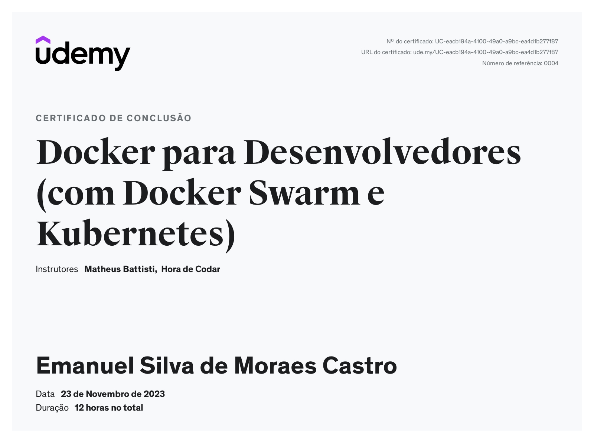

 
  Olá, meu nome é Emanuel Castro e sou <strong>Desenvolvedor Backend</strong>. 
  Atualmente minha stack principal é voltada para o desenvolvimento Web utilizando Java e Spring Boot. Curso ciência da computação e sou freelancer. As ferramentas que mais utilizo no meu dia a dia são: <strong>Spring Boot</strong>, <strong>Django</strong>, <strong>Docker</strong>, <strong>MySQL</strong>.

    ⚙️ <strong>Linguagens:</strong> 
    
    
    
    

    📠<strong>Frontend:</strong> 
    
    

    ☁️ <strong>Devops:</strong> 
    
    
    

    ☁️ <strong>Database:</strong> 
    
    
    
    

    🭠<strong>Frameworks:</strong> 
    
    
    
    

📖 <strong>Alguns dos meus Certificados: </strong> 
    
    
    
    
    
    

  💌 Contatos para falar comigo: ⤵️

  
  

